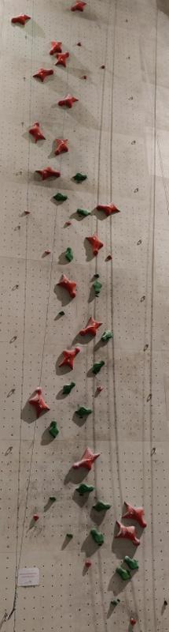
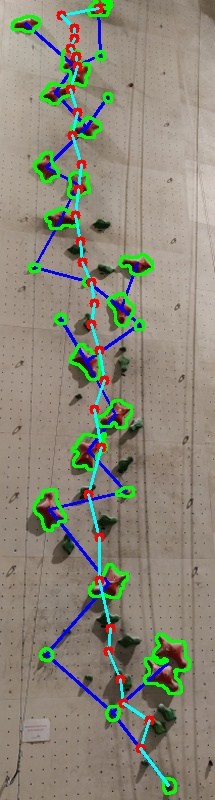

# CLIMBER_RECOGNIZER


<div align="center">
     
     
     
</div>


## Table of contents

-   [Description](#Description)
-   [Installation](#Installation)
-   [Running the project](#Running-the-project)

## Description
This project has two goals:
- The first is to create software capable of recognizing an indoor climbing route given a photo and the color of the route holds
- The second to perform tracking of a climber using a video as input. Two modes were used the first is with optical flow while the second is with background subtractor

To simulate this, a graphical user interface was created with python's tkinter library ATTENTION: This part works properly with python 3.10 with other python versions there may be problems with tkinter library. 

For more information, please refer to the [Report_project](https://github.com/Roman-Simone/Climber_recognizer/blob/main/Report_project.pdf) document. 

#### Results recognize climbing route

<div align="center">
   
   
</div>


#### Results tracking climber


<div align="center">
    
</div>


## Installation

In order to run the project you'll need to clone it and install the requirements. I suggest you to create a virtual environment. These are the steps:
- Clone it

    ```BASH
    git clone https://github.com/Roman-Simone/CLIMBER_RECOGNIZER.git
    ```
- Create the virtual environment 
  
    ```BASH
    python -m venv name_of_virtual_env
    ```
- Activate the virtual environment
    ```BASH
    source name_of_virtual_env/bin/activate
    ```
- Install the requirements
    ```BASH
    pip install -r requirements.txt
    ```

## Running the project

The project can be runned in two different ways:
- through the GUI:

    > [!WARNING]
    > This part works properly with python 3.10 with other python versions there may be problems with tkinter library.
  
    ```BASH
    python main.py     // It works properly with python 3.10 with other python versions there may be problems with tkinter library.
    ```
    After running it a menu will be opened and there select the demo you want to try out.
    

- Running directly:
  
    - To run the find route part demo:
        ```
        python FindClimbingRouteDemo.py
        ```
        
    - To run the GUI of find route

        ATTENTION: This part works properly with python 3.10 with other python versions there may be problems with tkinter library:
        ```
        python FindClimbingRoute.py  // It works properly with python 3.10 with other python versions there may be problems with tkinter library.
        ```
    - To run the Tracking Climber part:
        ```
        python TrackingClimber.py
        ```
        if you want to change the tracking modes change the variable method:
        ```
        method = "BackgroundSubtractorKNN"
        or
        method = "OpticalFlow"
        ```


# Contacts

Simone Roman - [simone.roman@studenti.unitn.it](mailto:simone.roman@studenti.unitn.it)

<a href="https://www.unitn.it/"></a>
